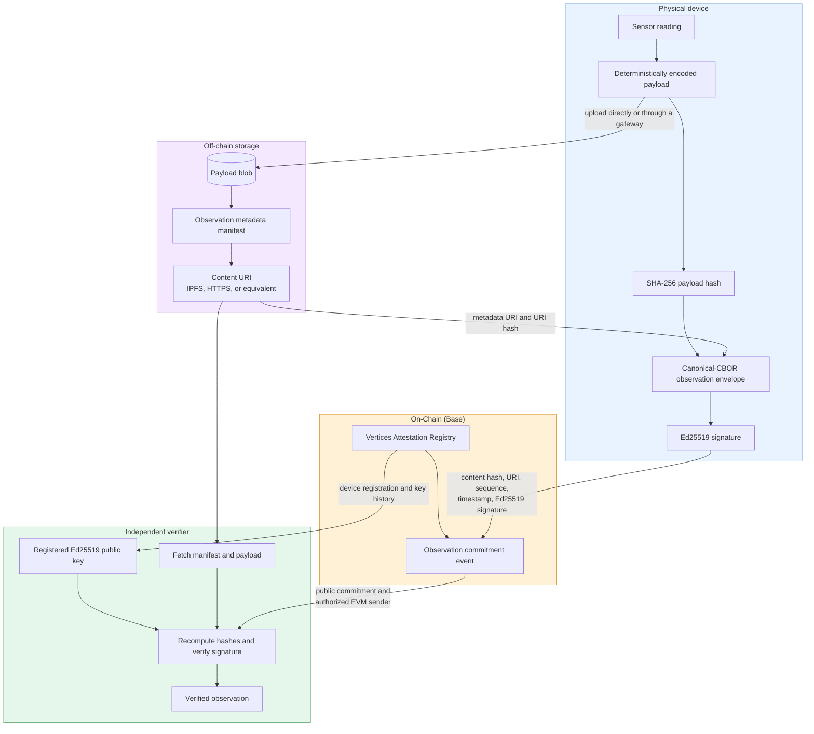

# Observation publication and verification flow

This diagram shows the trust boundary: storage and transport may be provided by a gateway or network service, but the device signs the evidence that identifies the exact payload and metadata reference.

## What the device commits to

The device creates an observation envelope with a versioned deterministic-CBOR encoding. It signs a domain-separated representation of the envelope with its Ed25519 observation key. The envelope commits to the device ID, sequence, timestamp, payload hash, payload-codec identifier, and metadata-URI hash.

The payload and metadata manifest remain off-chain. IPFS is a natural option because the content reference can be content-addressed, but an authenticated HTTPS endpoint or another storage system can be used when data needs access control or encryption.

## Publishing sequence

1. Encode the payload according to its declared deterministic codec and calculate its SHA-256 hash.
2. Upload the payload, directly or through a gateway, and create a metadata manifest that references it.
3. Obtain the manifest URI, build and sign the canonical observation envelope, then calculate its content hash.
4. The registered EVM account submits the content hash, metadata URI, sequence, timestamp, and Ed25519 signature to the Base registry.

The publisher or gateway can make data available, but it cannot substitute payload bytes, change the metadata URI, or modify observation fields without causing independent verification to fail.

## Off-chain verification

An independent verifier retrieves the registration/key history and the on-chain commitment event, then fetches the metadata manifest and payload. It verifies:

1. the payload bytes hash to the envelope’s `payload_hash`;
2. the metadata URI hashes to the envelope’s `metadata_uri_hash`;
3. the envelope’s canonical bytes and domain-separated signing input verify against the registered Ed25519 public key valid at the commitment block;
4. the envelope fields match the on-chain event; and
5. the event sender was the registered EVM address at that block and its sequence is consistent.

This proves data integrity and device-key evidence independently of the off-chain storage provider. It does not, by itself, prove hardware state; that requires the planned hardware-attestation extension.
